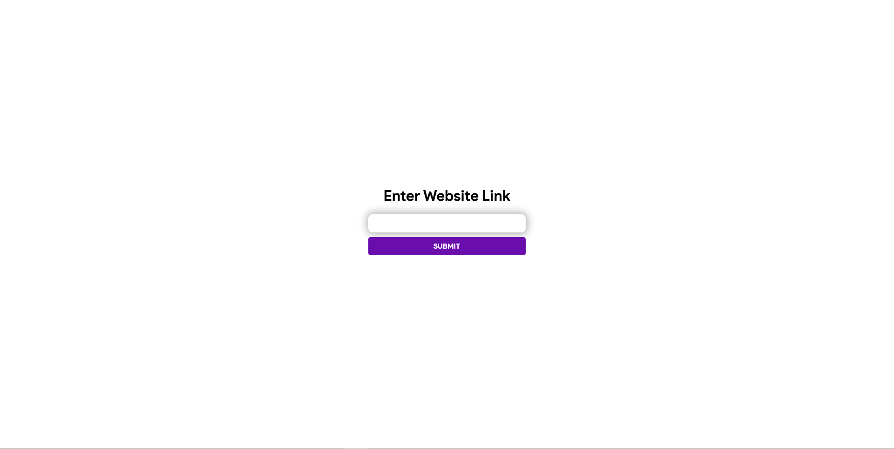

# 13 Feet Ladder

A site similar to [12ft.io](https://12ft.io) but is self hosted and works with websites that 12ft.io doesn't work with.

## What is this?

This is a simple self hosted server that has a simple but powerful interface to block ads, paywalls, and other nonsense. Specially for sites like medium, new york times which have paid articles that you normally cannot read. Now I do want you to support the creators you benefit from but if you just wanna see one single article and move on with your day then this might be helpful

## How does it work?

It pretends to be GoogleBot (Google's web crawler) and gets the same content that google will get. Google gets the whole page so that the content of the article can be indexed properly and this takes advantage of that.

## How do I use it?

### Recommended Hosting

If you want to use a hosting provider I recommended and personally use [TD Web Services](https://tdwebservices.com/)

### Using Docker

Requirements:
- docker
- Docker Compose (available as `docker compose`)

First, clone the repo to your machine then run the following commands:

```sh
git clone https://github.com/wasi-master/13ft.git
cd 13ft
docker compose up
```

The image is also available from [DockerHub](https://hub.docker.com/r/wasimaster/13ft "docker pull wasimaster/13ft") or [ghcr.io](https://github.com/wasi-master/13ft/pkgs/container/13ft "docker pull ghcr.io/wasi-master/13ft:0.2.3") so the command `docker pull wasimaster/13ft` also works.

### Standard Python script

First, make sure you have [python](https://python.org) installed on your machine. Next, clone the git repo. Then go to a terminal (`Command Prompt` on Windows, `Terminal` on Mac) and run the following command:

From the git cloned directory on your computer:

```sh
cd app/
python -m pip install -r requirements.txt
```

If that doesn't work retry but replace `python` with `py`, then try `python3`, then try `py3`

Then run `portable.py`, click [this link](https://realpython.com/run-python-scripts/) for a tutorial on how to run python scripts.

```sh
python portable.py
```

Then open the link shown in the terminal in the browser and you'll be able to use this

### Installation using venv and running under specific bind address / port

```sh
python3 -m venv venv
source venv/bin/activate
python -m pip install -r requirements.txt
FLASK_APP=app/portable.py flask run --host=127.0.0.1 --port=9982
```


## Using as a Bookmarklet in Chrome:

You can create a bookmarklet that performs the URL transformation by writing a small JavaScript snippet. Below is the JavaScript code for your bookmarklet:
```javascript
javascript:(function(){window.location.href='https://13ft.wasimaster.me/'+encodeURIComponent(window.location.href);})();
```
You can replace https://13ft.wasimaster.me with your own 13ft instance if desired.

Steps:
1. Open Bookmarks Manager:

2. Click on the three dots (menu) in the top-right corner of Chrome.
Go to Bookmarks > Bookmark manager, or simply press Ctrl+Shift+O on Windows/Linux or Cmd+Option+B on Mac.
Create a New Bookmark:

3. In the Bookmark Manager, click the three-dot menu in the top-right corner of the window and select Add new bookmark.
Enter Bookmark Details:
    - Name: Enter a name for your bookmarklet, such as "13ft-ize". This name will show as a bookmark title in the bookmarks bar
    - URL: Paste the JavaScript code provided above into the URL field.
4. Click Save.

Using the Bookmarklet:

Navigate to the page whose URL you want to use 13ft on.

Click on the bookmarklet you saved in your bookmarks bar. The browser will redirect you to the 13ft version of the URL using your service.

To show Bookmarks in Chrome, click the icon with three horizontal bars in the top right corner to open options. 2. In options, hover over "Bookmarks" to display a second menu where you can click the "Show bookmarks bar" text to toggle the bar on or off.

Instructions courtesy of [@barakplasma](https://github.com/barakplasma)

## Customizing listening host and port, Systemd / Reverse-proxy example

### Systemd Service

```
/lib/systemd/system/13ft.service
```

```
[Unit]
Description=13ft Flask Service
Wants=network-online.target
After=network-online.target

[Service]
Type=simple
Restart=on-failure
RestartSec=10
User=www-data
Group=www-data
Environment=APP_PATH=/var/www/paywall-break
Environment=FLASK_APP=app/portable.py

ExecStart=/bin/bash -c "cd ${APP_PATH};${APP_PATH}/venv/bin/flask run --host=127.0.0.1 --port=22113"

# Make sure stderr/stdout is captured in the systemd journal.
StandardOutput=journal
StandardError=journal

[Install]
WantedBy=multi-user.target
```

### Reverse Proxy

```
<VirtualHost *:22114>
    ErrorLog ${APACHE_LOG_DIR}/13ft-error.log
    CustomLog ${APACHE_LOG_DIR}/13ft-access.log combined

    ProxyRequests Off

    SSLEngine on
    SSLCertificateFile      /etc/ssl/certs/ssl-cert-snakeoil.pem
    SSLCertificateKeyFile /etc/ssl/private/ssl-cert-snakeoil.key
    Header always set Strict-Transport-Security "max-age=63072000"
    SSLProtocol             all -SSLv3 -TLSv1 -TLSv1.1

    SSLHonorCipherOrder     off
    SSLSessionTickets       off

    Protocols h2 http/1.1

    <Proxy *>
        Order deny,allow
        Allow from all
    </Proxy>


    ProxyPass / http://127.0.0.1:22113/
    ProxyPassReverse / http://127.0.0.1:22113/


</VirtualHost>
```

## Screenshots

### Step 1


Go to the website at the url shown in the console

### Step 2


Click on the input box

### Step 3


Paste your desired url

### Step 4


Voilà you now have bypassed the paywall and ads

### Alternative method

You can also append the url at the end of the link and it will also work. (e.g if your server is running at `http://127.0.0.1:5000` then you can go to `http://127.0.0.1:5000/https://example.com` and it will read out the contents of `https://example.com`)

This feature was implemented by [@atcasanova](https://github.com/atcasanova)
